<div align="center">

<!-- Hero Banner (Theme Responsive) -->
<picture>
  <source media="(prefers-color-scheme: dark)" srcset="./dark.svg">
  <source media="(prefers-color-scheme: light)" srcset="./light.svg">
  
</picture>

<br><br>

[](https://weraxx.sghome.space)
[](https://sghome.space)
[](https://github.com/weranganimsara)
[](https://github.com/weranganimsara)
[](mailto:weranganimsara2007@gmail.com)

</div>

---

### ⚡ System Overview (`whoami`)

```terminal
[wera@node ~]$ whoami --verbose
> Name        : Weranga Nimsara (WERA Xx‿x𝙓)
> Role        : Full-Stack Web Developer, Backend Architect & VPS Specialist
> Location    : Sri Lanka (Asia/Colombo — UTC+5:30)
> Core Focus  : High-throughput Web Platforms, 3X-UI Cloud Tunneling, Autonomous AI & VPS Infrastructure
> Ecosystem   : SG Home (sghome.space)
```

> **🌐 Digital Universe — Where Ideas Become Reality.**  
> *Building robust digital experiences from zero to production.*

---

### 🛠️ Technical Arsenal

<table align="center" width="100%">
  <tr>
    <td width="50%" valign="top">
      <h4>💻 Frontend & Web Development</h4>
      <ul>
        <li><b>TypeScript & JavaScript (ESNext)</b> — Strict typing, modern async flows</li>
        <li><b>HTML5 & Native CSS3</b> — Glassmorphism, cyber UI grids, responsive layouts</li>
        <li><b>React / Vite</b> — Fast, modern component-driven frontends</li>
        <li><b>Dynamic Canvas & Graphics</b> — Interactive particle engines & typewriter UI</li>
      </ul>
    </td>
    <td width="50%" valign="top">
      <h4>⚙️ Backend & API Engineering</h4>
      <ul>
        <li><b>Node.js & Express</b> — Scalable RESTful APIs & high-load microservices</li>
        <li><b>Python</b> — Automation scripts, AI system tools, payload decryption</li>
        <li><b>MongoDB & Mongoose</b> — Data schemas, transactions & real-time caching</li>
        <li><b>WebSockets</b> — Bi-directional event streaming & real-time messaging</li>
      </ul>
    </td>
  </tr>
  <tr>
    <td width="50%" valign="top">
      <h4>☁️ Cloud, VPS & Infrastructure</h4>
      <ul>
        <li><b>Linux (Ubuntu / Debian VPS)</b> — Server hardening, systemd daemons, ufw</li>
        <li><b>Nginx Reverse Proxy</b> — SSL/TLS certbot automation, reverse proxying, load balancing</li>
        <li><b>Cloudflare Ecosystem</b> — DNS management, CDN edge caching, Argo tunnels</li>
        <li><b>Billing & Webhooks</b> — Automated payment gateways (PayHere) & IPN verification</li>
      </ul>
    </td>
    <td width="50%" valign="top">
      <h4>🛡️ Network Security & Protocols</h4>
      <ul>
        <li><b>3X-UI Panel Management</b> — Multi-port inbound setup & dynamic client routing</li>
        <li><b>Xray Core & Protocols</b> — Trojan, VLESS, Shadowsocks with TLS disguise</li>
        <li><b>SNI Zero-Rating Engineering</b> — Deep Packet Inspection (DPI) header optimization</li>
        <li><b>High-Availability Clusters</b> — Multi-ISP routing with low-latency endpoints</li>
      </ul>
    </td>
  </tr>
</table>

---

### 🚀 Production Ecosystem & Featured Repositories

```yaml
Ecosystem: SG Home (https://sghome.space)
Owner: Weranga Nimsara (WERA Xx‿x𝙓)
Status: Active & Scaling

Featured Deployments:
  - name: SG Home PanelX (SGPX)
    repo: weranganimsara/PanelX
    type: Management Dashboard
    description: High-performance administration dashboard & cloud service manager with interactive cyber controls.
    tech: [HTML5, CSS3, JavaScript, Dashboard Architecture]

  - name: SG Home Gift Network
    repo: weranganimsara/SG-Home-Gift-site
    type: Web Platform
    description: Interactive community rewards, voucher generation, and claim portal.
    tech: [TypeScript, Modern Web, React]

  - name: WeraXX-Vinci
    repo: weranganimsara/WeraXX-Vinci
    type: AI & Automation
    description: Autonomous AI Assistant & Windows OS Controller built with custom automation pipelines.
    tech: [Python, Automation, AI Systems, OS Control]

  - name: ChatX Suite
    repo: weranganimsara/ChatX & ChatX-Android
    type: Real-Time Messaging
    description: End-to-end communication network with web and mobile native clients.
    tech: [TypeScript, WebSockets, Android, REST]

  - name: High-Availability Proxy Network & 3X-UI Billing
    repo: weranganimsara/SG-Home-Paid-Site
    type: Infrastructure & Billing
    description: Fully automated 3X-UI client provisioning system with automated LKR billing checkout (serving 100k+ monthly requests).
    tech: [Node.js, Express, MongoDB, 3X-UI API, Linux VPS, PayHere]
```

---

### 📊 GitHub Activity & Metrics

<div align="center">


<br><br>


</div>

---

### 💬 Connect & Collaborate

<div align="center">

<a href="https://weraxx.sghome.space"></a>
<a href="https://sghome.space"></a>
<a href="https://github.com/weranganimsara"></a>
<a href="mailto:weranganimsara2007@gmail.com"></a>

<br><br>

<sub>Designed with high precision &bull; System Active &bull; &copy; Weranga Nimsara (WERA Xx‿x𝙓)</sub>

</div>
